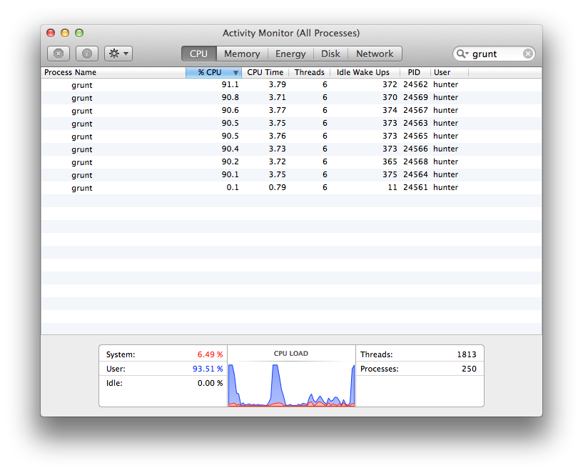

# grunt-multicore

> Divide Grunt tasks to run across multiple cores

This is particularly helpful for Grunt users who auto-generate their task targets using a static configuration generation module. If one is using, for example, [Assemble](http://assemble.io/), and they are configuring a task for each individual page, and if they have a site of sufficient size, and one doesn't care the order in which those task targets are called, with grunt-multicore they can split hundreds or thousands of auto-generated Assemble tasks over several cores, as illustrated in the screenshot below:



## Rationale

This task was forked from [grunt-concurrent](https://github.com/sindresorhus/grunt-concurrent). What it does differently is, it chunks up a particular task across the specified number of cores. grunt-concurrent, if (mis)configured, will spawn a process per individual target, and execute those in-order, causing a massive delay in processing time. :crying_cat_face: Even worse, [grunt-parallel](https://github.com/iammerrick/grunt-parallel) will attempt to spawn each process at once, virtually fork-bombing the developer's system, causing it to either hang or behave in strange ways, and ultimately resulting in a restart. :scream_cat: Those packages do have their uses for smaller number of parallel processes, but ultimately, the rationale for the new package is for those who wish to run a great deal of task targets (hundreds or thousands) on all or some of the CPUs on that system. If used correctly, this should result in a dramatic reduction in the time necessary to execute Grunt. :smirk_cat:

Admittedly, the terminal output is rather ugly, as a quick & dirty method to communicate between processes was implemented.

**An important note!** Using `grunt.option.config` to generate config is not something that can be done for spawned processes. Instead, a proxy task was created in order to spawn multiple child processes with the 'chunked' tasks to be run in serial. For this reason, it's important to not use grunt.config.set for any task meant to be split across multiple cores.

## Getting Started

If you haven't used [grunt][] before, be sure to check out the [Getting Started][] guide, as it explains how to create a [gruntfile][Getting Started] as well as install and use Grunt plugins. Once you're familiar with that process, install this plugin with this command:

```bash
$ npm install grunt-multicore --save-dev
```

Once the plugin has been installed, it may be enabled inside your Gruntfile with this line of JavaScript:

```js
grunt.loadNpmTasks('grunt-multicore');
```

*Tip: the [load-grunt-tasks](https://github.com/sindresorhus/load-grunt-tasks) module makes it easier to load multiple grunt tasks.*


[Grunt]: http://gruntjs.com
[Getting Started]: https://github.com/gruntjs/grunt/wiki/Getting-started


## Documentation

The `multicore` task accepts a property with the same name of the task, and a list of that tasks's targets. That list can be either an object with keys named for the actual tasks, or an array of task strings. In the latter case, the task string must contain the target task name, followed by a colon, followed by a target name. These must correspond to actual tasks in your config, and this config cannot be generated by Grunt using grunt.config.set methods, but instead, should be created using the Node.js runtime logic, and then passing that config object to grunt.config.init, as usual.

### Example

For those using [Assemble](http://assemble.io/), one can find themselves creating hundreds or thousands of pages, especially if auto-generated using configuration from a consumed API or a collection of detected files. The following example config is for those who wish to really kick their fans into overdrive... For a couple seconds, anyway.

```js
var assembleTasks = require('assemble-config')(grunt, sites);

grunt.initConfig({
	taskname:
		files: [taskfiles],
	multicore: {
		taskname:
			files: [taskfiles]
	}
});

grunt.loadNpmTasks('grunt-multicore');
grunt.registerTask('default', ['assemble', 'multicore:assemble']);
```

The "assemble-config" module is just shown as an example Node.js module that might be written to generate data such as this:

`['assemble:sales', 'assemble:events', 'assemble:directory', 'assemble:articles', 'assemble:articles-0001', ...]`

## Options

### limit

Type: `Number`
Default: Number of logical CPU cores, with a minimum of 2

Limit of how many cores are utilized.

### log

Type: `Boolean`
Default: `false`

## Release History

 * 2014-04-14   v0.1.0  First release.
 * 2015-01-21 	v0.2.0	Altered scope of project. No longer accepts a live object, but instead spawns tasks for files.

## License

[MIT](http://opensource.org/licenses/MIT) © [Hunter Trujillo](http://infocraft.org) :smiley_cat:
